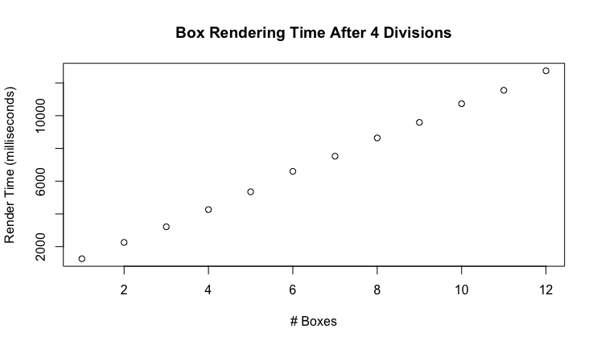

# Ben Holmgren Lab 9
---
As a baseline, running the provided code gave us the following times for each number of boxes:

---

Then, several techniques were attempted unsuccessfully to reduce runtime of our rendering algorithm. 
I began by implementing a bounding box class, which then fell short when trying to be incorporated into values from all of the many other classes that were implemented alongside our main program. 
So then, I implemented a seperate class which would bound just the spheres in a seperate cube, this cube would be intersected by our ray intersection method, and then we could at least eliminate the spheres from our recurring iterations. 
This too was unsuccessful, as a result of the complexity of the innerworkings of the dependent code, and I could only gain segmentation fault errors.

---

However, I then implemented successfully a bounding box for positive and negative x-valued boxes, which effectively cut the runtime in half. 
My findings are as follows:

---

After this, I thought splitting the area we're considering for the first intersection again should split the rendering time again in half.
So I then split the frames of consideration into positive and negative y valued sections, alongside positive and negative x values, which caused rendering to occur at 4x the initial speed. 
And, the following data shows that this was exactly the case:

---

And For fun, here is the resulting image after 12 boxes were created on our final test run:

